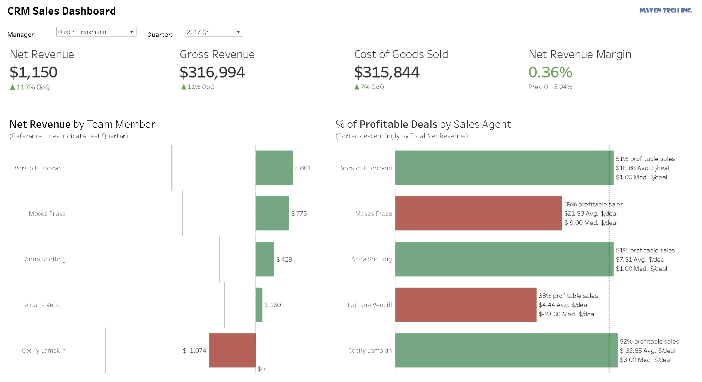
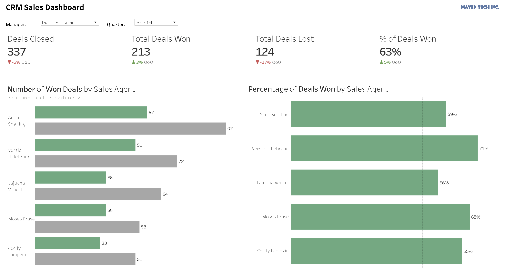

CRM Sales Dashboard 
======================================

**Tools Used**: Python, Tableau, Microsoft Excel, Jupyter Notebook, Microsoft Word  

In this project, I performed the end-to-end dashboard construction process with the goal of empowering sales managers of a fictional company to measure the quarterly performance of their team of sales agents.

* If you would like to navigate to the **final dashboard** in Tableau Public, please [click here](https://public.tableau.com/views/CRMSalesDashboard_17252277791160/RevenueDashboard?:language=en-US&:sid=&:redirect=auth&:display_count=n&:origin=viz_share_link).  
* If you want to watch ME demo the dashboard in a **video presentation**, please [click here](https://www.loom.com/share/f19cbe2045dc410ca67435ff5c87b0e7).  
* Lastly, the **project wrap-up** including an explanation of deliverables and a written demo of the dashboard can be found [here](Wrap-Up%20Final%20Insights%20and%20Recommendations.docx).

The general steps taken included:
* **Process Planning:** Visual and written planning for the project as a whole.
* **Measurement Planning:** Mapping the high-level objectives of the entire company into the key questions that sales managers would want to answer about their teams (e.g. revenue, customer satisfaction, and efficiency).
* **Conceptual Dashboard Planning and Design:** Choosing the specific metrics and desired visualizations for the ideal dashboard to measure performance and trajectories to meeting those key goals.
* **Data Quality Assurance:** Identifying data needs that would facilitate constructing the ideal dashboard. Then, performing extensive data validation and cleaning to make sure the data we had was good enough to continue on to the dashboard software.
* **Data Aggregation:** Filtering and combining the individual tables to form the final data source that would feed into our dashboard. This step also included going through our ideal KPI checklist and seeing how much of that we could create with our current data (we were not able to calculate every metric due to missing key fields).
* **Dashboard Construction and Refining:** Multiple iterations of constructing impactful visualizations and displaying pertinent information to ultimately help the end-users answer as many key questions as possible.
* **Final Insights and Recommendations**: Briefly summarizing the project and would further recommendations we would give if we were to own this dashboard in a company and continue improving in the future.
  
View 1 (Revenue Performance):

  
View 2 (Efficiency Performance):
